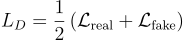
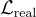
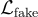
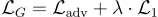

# Image Colorization with GAN

This project focuses on the colorization of grayscale images using a GAN (Generative Adversarial Network). The model consists of a U-Net generator and a CNN-based discriminator. 

## Files Overview

### 1. `network.py`
This file defines the neural network models used in the project:
- **UNetGenerator**: A U-Net-based generator responsible for converting grayscale images into colorized images. The architecture includes several downsampling and upsampling blocks, utilizing skip connections for efficient feature propagation.
  
#### U-Net Architecture
The U-Net architecture follows a typical encoder-decoder structure:
- **Downsampling** (contracting path):
  - 5 convolutional blocks that reduce the spatial dimensions by half at each step while increasing the number of feature channels. 
  - Each block consists of two convolutional layers followed by batch normalization, LeakyReLU activation, and max-pooling.
- **Upsampling** (expanding path):
  - 4 up-convolutional blocks that expand the spatial dimensions by using transposed convolutions.
  - Each up-convolutional block is followed by concatenation with the corresponding downsampling output (skip connection), helping the network retain spatial information from the input image.

- **Discriminator**: A simple CNN-based network that receives both real color images and generated images. It learns to distinguish between real and fake (generated) images.

### 2. `ops.py`
Contains utility functions used throughout the project, such as:
- **prepare_input**: Converts an RGB image into a grayscale format, as the generator takes grayscale images as input.

### 3. `train.py`
This is the main training script where the actual model training happens. It includes the following key components:

#### Training Loop Breakdown:
1. **Loading the dataset**: 
   - The dataset consists of 100,000 images numbered from `00000.jpg` to `99999.jpg`. Each image is loaded during training and resized to `1024x1024`.
   
2. **Forward Pass of the Generator**:
   - Grayscale images are passed through the U-Net generator to produce colorized images. This step aims to generate realistic color images based on the grayscale input.

3. **Discriminator Loss**:
   - The discriminator receives both real color images and generated images and outputs a prediction score for each.
   - The loss function for the discriminator is computed by comparing its predictions on real images (target = 1) and fake images (target = 0). This is a binary classification task.
   - The formula used for the discriminator loss is:

    
     

     where:
     -  is the binary cross-entropy loss for the real images, and
     -  is the binary cross-entropy loss for the generated (fake) images.

4. **Generator Loss**:
   - The generator aims to fool the discriminator, so its output should be as close as possible to real images.
   - The generator loss consists of two components:
     - **Adversarial Loss**: Encourages the generator to produce images that are classified as real by the discriminator.
     - **L1 Loss**: A pixel-wise loss that penalizes large differences between the generated image and the ground truth image. This helps in producing more accurate colorizations.
   
   The total generator loss is given by:

   - 
   
   where \(\lambda\) is a weight (in this case, 100) that balances the adversarial and L1 losses.

5. **Backward Pass and Optimization**:
   - Both the generator and discriminator networks are optimized separately:
     - First, the discriminator is updated based on the real and fake images.
     - Next, the generator is updated based on its ability to fool the discriminator and produce accurate colorizations.
   
6. **Saving the Model**:
   - At regular intervals, the model weights are saved to the `saved_models/` directory for future use and testing.

### 4. `test.py`
This file is used to test the trained generator on new grayscale images and save the colorized output.

- It loads a pretrained generator model and takes a grayscale image as input.
- The generator converts the grayscale image to a color image, which is saved in the `results/` folder with the prefix `colorized_`.

### 5. Dataset
- The dataset contains 100,000 images named `00000.jpg` to `99999.jpg`. No separate label files (like `labels.csv`) are provided, as the color information is inherent in the images themselves.

## Training Process

Here is an overview of the step-by-step training process:

1. **Load the dataset**:
   - Images are loaded from the dataset folder, resized to `1024x1024`, and converted to tensors.
   
2. **Forward pass of the generator**:
   - The grayscale version of each image is passed through the U-Net generator to produce a colorized image.

3. **Discriminator Training**:
   - The discriminator receives both real images and generated (fake) images.
   - It outputs predictions, where the real images should be classified as 1 (real) and the generated images as 0 (fake).
   - The discriminator loss is computed, and the discriminator is updated.

4. **Generator Training**:
   - The generator tries to create images that the discriminator classifies as real (1). At the same time, it tries to minimize the pixel-wise difference between the generated and real images.
   - The generator loss is computed, which includes both the adversarial and L1 losses.
   - The generator is updated based on this loss.

5. **Model Saving**:
   - The generator and discriminator models are saved after a specified number of epochs to allow for later testing and evaluation.


## Requirements

- Python 3.x
- PyTorch
- torchvision
- Pillow

## Running the Code

1. **Training**: To train the model, run:
   ```
   python train.py
   ```

2. **Testing**: To test the model and save the output:
   ```
   python test.py
   ```
